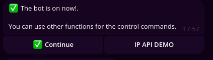

---

<h1>TGbase 🤖</h1>

## Descripción 📝

TGbase es una plantilla de un bot diseñado para optimizar y agilizar el desarrollo de proyectos basados en Python, enfocando la creación de bots de telegram a base de la librería de Python, Pyrogram, que permite comunicarse con la API de telegram con el fin de realizar tareas y mandar mensajes a través de filtradores de eventos.

## Objetivos 🎯

Crear una plantilla enfocada en la productividad y sustentabilidad de proyectos cuya magnitud sean grandes y pequeñas, contando con pequeñas herramientas que agilizan el proceso de la estructuración y arquitectura del bot usando un sistema de <i>postdatas</i>, que permiten una mejor comunicación e interacción a través de botones enviados al cliente, buscando evitar crear código innecesario y repetitivo para principiantes.

## Requisitos 🛠️

- <code>pyrogram</code> Una librería que permite comunicarse con la API de telegram.

## Compatibilidad 🔨

|   Entorno   | Es compatible | Probado en |
|:------------:|:------------:|:------------:|
|   Windows   |   ❓   |   ❌   |
|   Linux     |   ✅   |   ✅   |

## Screenshot 📸

